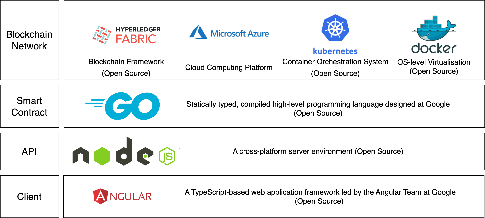

# Loughborough University - PHD Project - BT-RCPG Model - Seongha Hwang

## About The Project

This project is Seongha's PhD project named as Blockchain-Enabled Relational Project Governance.

### Supervisors

1. [Dr Karen Blay](https://www.lboro.ac.uk/departments/abce/staff/karen-blay/)
2. [Dr Mingzhu Wang](https://www.lboro.ac.uk/departments/abce/staff/mingzhu-wang/)
3. [Professor Mohamed Osmani](https://www.lboro.ac.uk/departments/abce/staff/mohamed-osmani/)

### PhD Student

[Seongha Hwang](https://www.lboro.ac.uk/departments/abce/staff/seongha-hwang/)

[LinkedIn](https://uk.linkedin.com/in/seongha-hwang-a478a068)

### Specific Development
1. User Interface: https://github.com/sseongha11/hf-kubernetes-frontend
2. API: https://github.com/sseongha11/hf-kubernetes-api
3. Smart Contract: https://github.com/sseongha11/hf-kubernetes-asset-transfer-smart

4. Docker (User Interface): https://hub.docker.com/repository/docker/sseongha11/hlf-frontend/general
5. Docker (API): https://hub.docker.com/repository/docker/sseongha11/api/general
6. Docker (Smart Contrat): https://hub.docker.com/repository/docker/sseongha11/basic-cc-hlf/general


### Built With




* Blockchain Framework: [Hyperledger Fabric](https://hyperledger-fabric.readthedocs.io/en/latest/)
* Cloud Computing Platform: [Microsoft Azure](https://azure.microsoft.com/en-gb)
* Container Orchestration Syste: [Kubernetes](https://kubernetes.io/) 
* OS-level Virtualisation: [Docker](https://www.docker.com/)
* Smart Contract: [GO](https://go.dev/)
* API: [NodeJS](https://nodejs.org/en)
* User Interface: [Angular](https://angular.io/)


## Getting Started
- BT-RCPG System User-Interface: https://bt-rcpg-seongha.com/

- BT-RCPG Blockchain Database: https://explorer.bt-rcpg-seongha.com/

- BT-RCPG Blockchain API: https://api.bt-rcpg-seongha.com/


- CouchDB (Check localhost:port/_utils)
```sh
kubectl port-forward services/peer0-org1 5984:5984
kubectl port-forward services/peer0-org2 5985:5984
kubectl port-forward services/peer0-org3 5986:5984
```

- Comparison: RCPG (General DB Version) - https://solid-ruler-346321.nw.r.appspot.com/

## License

See `LICENSE.md` for more information.
